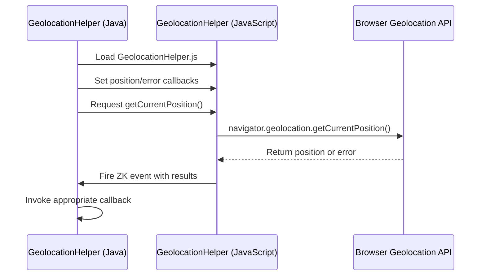

# Overview
This project is a simple ZK addon based on ZK CE (compact edition) that wraps various browser built-in JavaScript API in Java.

# The JavaScript API to wrap
* [Geolocation API](https://developer.mozilla.org/en-US/docs/Web/API/Geolocation_API/Using_the_Geolocation_API)
* [Clipboard API](https://developer.mozilla.org/en-US/docs/Web/API/Clipboard_API)
* [Notification API](https://developer.mozilla.org/en-US/docs/Web/API/Notification)
* [Web Speech API](https://developer.mozilla.org/en-US/docs/Web/API/Web_Speech_API)
* [MediaDevices](https://developer.mozilla.org/en-US/docs/Web/API/MediaDevices)
* [Drag and Drop API](https://developer.mozilla.org/en-US/docs/Web/API/HTML_Drag_and_Drop_API)

# Usage Examples
see *.java and *.zul under src/test/

# ClipboardHelper

The ClipboardHelper provides access to the browser's Clipboard API for reading and writing clipboard content.
## Important Notes
⚠️ **Its methods must be called within an event listener**: ClipboardHelper operations must be triggered from user interactions (click, keypress, etc.) due to browser security restrictions. Calling outside of event handlers will fail.

⚠️ **Security concern**: When handling clipboard content, you should sanitize user input yourself before using it in your application to prevent potential security vulnerabilities.

# GeolocationHelper Architecture

## Overview
The GeolocationHelper provides a robust, event-driven wrapper for the browser's Geolocation API, implementing a desktop-scoped singleton pattern for seamless integration with ZK applications.

## Key Architectural Patterns

### Singleton Desktop-Level Management
- Only one GeolocationHelper instance is allowed per page
- Enforces strict resource management and prevents multiple concurrent geolocation requests

### Event-Driven Communication
Bridges Java and JavaScript through a custom event mechanism:
- Java side defines callback consumers for success and error scenarios
- JavaScript side triggers ZK events with geolocation results

## Architecture Diagram



### Key Implementation Details
- Uses ZK's `Clients.evalJavaScript()` for cross-layer communication
- Dynamically loads JavaScript helper via ZK's `Script` component
- Supports clean disposal of resources with `dispose()` method

### Usage Example
```java
new GeolocationHelper(
    position -> handleSuccess(position),  // Success callback
    error -> handleError(error)           // Error callback
).getCurrentPosition();
```

**Note**: Geolocation access is subject to user permissions and browser support.

# Release Process
1. change version in `pom.xml` to official version
2. run [release](release/release)
3. set tag in GitHub as version (e.g. `v1.0.0`)
4. Publish to ZK Maven CE repository with jekins3/PBFUM

## Build jar
* freshly
`./release.sh`

* Official
`./release.sh official`

## Publish to Maven
[jenkins job]()

## License
* Source Code - [Apache License 2.0](http://www.apache.org/licenses/LICENSE-2.0)
