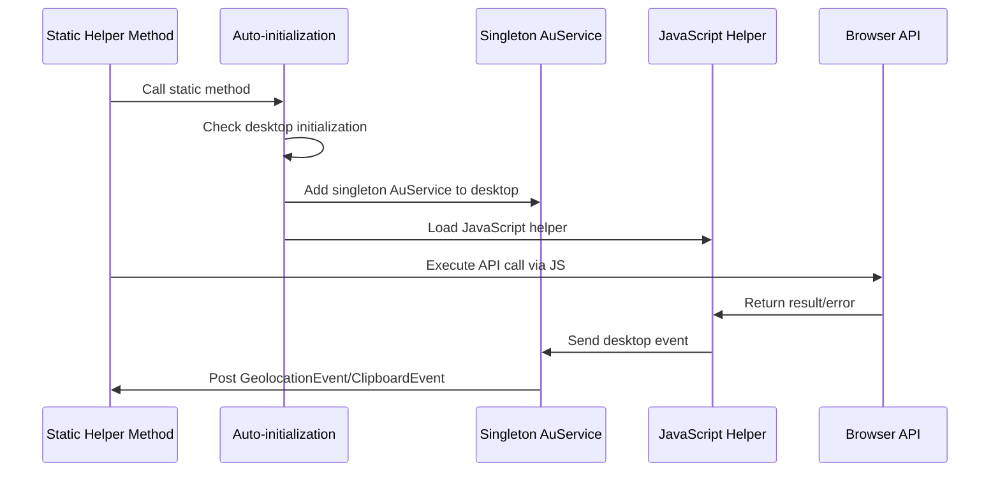

# Overview
This project is a simple ZK addon based on ZK CE (community edition) that wraps various browser built-in JavaScript API in Java.

# The JavaScript API to wrap
* [Geolocation API](https://developer.mozilla.org/en-US/docs/Web/API/Geolocation_API/Using_the_Geolocation_API)
* [Clipboard API](https://developer.mozilla.org/en-US/docs/Web/API/Clipboard_API)
* [Notification API](https://developer.mozilla.org/en-US/docs/Web/API/Notification) (not yet supported)
* [Web Speech API](https://developer.mozilla.org/en-US/docs/Web/API/Web_Speech_API) (not yet supported)
* [MediaDevices](https://developer.mozilla.org/en-US/docs/Web/API/MediaDevices) (not yet supported)
* [Drag and Drop API](https://developer.mozilla.org/en-US/docs/Web/API/HTML_Drag_and_Drop_API) (not yet supported)

# Run Demo Application
Require Maven installed.
1. Run `mvn jetty:run`
2. Navigate to `http://localhost:8080/browser-kit/`

# Usage Examples
see *.java and *.zul under src/test/


# Install via Maven

```xml
<dependency>
    <groupId>org.zkoss.zkforge</groupId>
    <artifactId>browser-kit</artifactId>
    <version>2.0.0</version>
</dependency>
```

Include ZK CE repository
```xml
        <repository>
            <id>ZK CE</id>
            <name>ZK CE Repository</name>
            <url>https://mavensync.zkoss.org/maven2</url>
        </repository>
```

# Browser API Helpers Architecture

Both ClipboardHelper and GeolocationHelper implement a unified, stateless design pattern that provides seamless integration with ZK applications.

## Unified Architecture Overview

Both helpers implement a consistent stateless architecture with auto-initialization and singleton AuService pattern for optimal resource management and developer experience.

### Key Architectural Patterns

#### Stateless Static Methods
- All public methods are static for simplified usage
- No instance management required - just call the methods directly

#### Singleton AuService Pattern
- Single AuService instance shared across all desktops 
- Desktop-level initialization tracking prevents duplicate setup
- Efficient resource utilization with proper cleanup support

#### Event-Driven Communication
```
Browser API → JavaScript Helper → zAu.send(desktop event) 
    → AuService → Desktop Event → Controller(Composer/ViewModel) Listeners
```

## ClipboardHelper

The ClipboardHelper provides static access to the browser's Clipboard API for reading and writing clipboard content.
* Secure context: This feature is available only in [secure contexts (HTTPS)](https://developer.mozilla.org/en-US/docs/Web/Security/Secure_Contexts)

### Usage Example
```java
// Writing to clipboard
ClipboardHelper.writeText("Hello World");

// Reading from clipboard (results via events)
ClipboardHelper.readText();

// Listening for results
@Listen(ClipboardEvent.EVENT_NAME + " = #root")
public void handleClipboard(ClipboardEvent event) {
    ClipboardResult result = event.getClipboardResult();
    if (result.isSuccess()) {
        processClipboardContent(result.getText());
    }
}
```

### Important Notes
⚠️ **User interaction required**: Clipboard operations must be triggered from user interactions (click, keypress, etc.) due to browser security restrictions.

⚠️ **Security concern**: When handling clipboard content, sanitize user input to prevent potential security vulnerabilities.

## GeolocationHelper

The GeolocationHelper provides static access to the browser's Geolocation API for requesting user location.
* Secure context: This feature is available only in secure contexts (HTTPS)

### Usage Example
```java
// Request current position
GeolocationHelper.getCurrentPosition();

// Listen for results
@Listen(GeolocationEvent.EVENT_NAME + " = #root")
public void handleGeolocation(GeolocationEvent event) {
    if (event.isSuccess()) {
        GeoLocationPosition position = event.getGeoLocationPosition();
        processLocation(position);
    } else {
        handleLocationError(event.getGeoLocationPositionError());
    }
}
```

### Implementation Benefits
- **Simplified API**: No instance management - direct static method calls
- **Desktop-level Events**: Multiple composers can listen independently
- **Resource Efficiency**: Singleton AuService pattern minimizes overhead
- **Clean Lifecycle**: Optional `dispose()` method for explicit cleanup

### Architecture Diagram



### Usage Examples
- ClipboardHelper: see [ClipboardComposer.java](src/test/java/test/clipboard/ClipboardComposer.java)
- GeolocationHelper: see [LocationComposer.java](src/test/java/test/geolocation/LocationComposer.java)

**Note**: Both helpers require user permissions and are subject to browser support and security restrictions.

# Release Process
1. change version in `pom.xml` to official version
2. run [release](release/release)
3. set tag in GitHub as version (e.g. `v1.0.0`)
4. Publish to ZK Maven CE repository with jekins3/PBFUM

## Build jar
* freshly
`./release.sh`

* Official
`./release.sh official`


## License
* Source Code - [Apache License 2.0](http://www.apache.org/licenses/LICENSE-2.0)
