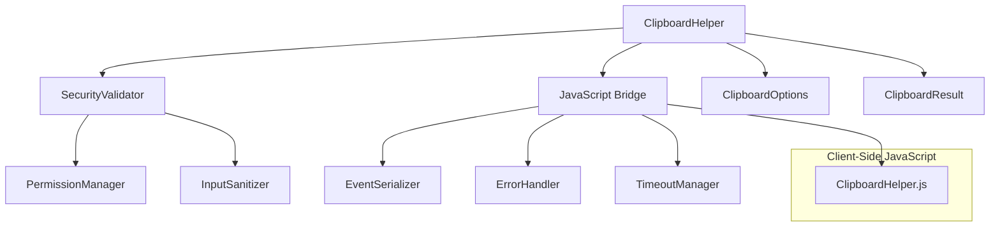
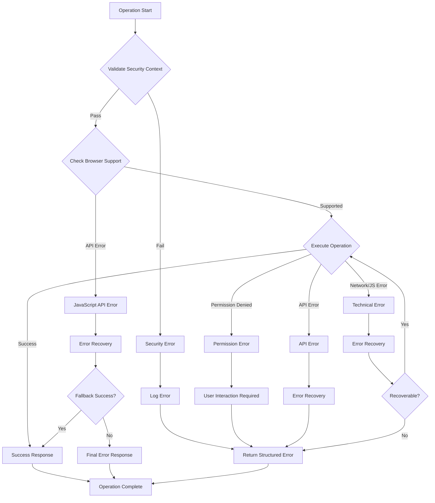

# ZK Clipboard API Component - System Architecture Design

## Executive Summary

This document provides a comprehensive system architecture for enhancing the existing BrowserKit ClipboardHelper component to meet enterprise requirements while maintaining backward compatibility and following ZK framework patterns. The design addresses the key architectural challenges of security, error handling, and reliable Java-JavaScript communication within a phased implementation approach.

**Key Architectural Decisions:**
- **Security-First Design**: Multi-layered validation with user interaction tracking and permission state management
- **Modern Browser Support**: Leverages modern Clipboard API available across all major browsers
- **Event-Driven Architecture**: Leveraging ZK's existing event system for reliable async communication
- **Component Lifecycle Management**: Proper resource management and cleanup within ZK page lifecycle
- **Extensible Design**: Modular architecture supporting future rich content features

## System Overview

### High-Level Architecture

```
┌─────────────────────────────────────────────────────────────────┐
│                    ZK Application Layer                         │
├─────────────────────────────────────────────────────────────────┤
│  ClipboardHelper API  │  ClipboardOptions  │  ClipboardResult   │
├─────────────────────────────────────────────────────────────────┤
│                   Security & Validation Layer                   │
│  • Permission Validation  • User Interaction Tracking          │  
│  • Input Sanitization    • HTTPS Context Verification          │
├─────────────────────────────────────────────────────────────────┤
│                    Java-JavaScript Bridge                       │
│  • Event Serialization   • Error Propagation                   │
│  • Timeout Management    • Direct Clipboard API Access        │
├─────────────────────────────────────────────────────────────────┤
│                      Browser Platform                           │
│     Modern Clipboard API (All Major Browsers)                  │
└─────────────────────────────────────────────────────────────────┘
```

### Component Relationships



## Architecture Components

### 1. Enhanced ClipboardHelper (Core Component)

**Responsibilities:**
- Primary API facade for clipboard operations
- Component lifecycle management
- Security context validation
- Error handling coordination

**Key Design Patterns:**
- **Builder Pattern** for ClipboardOptions configuration
- **Observer Pattern** for async callback handling
- **Factory Pattern** for browser-specific implementations
- **Template Method** for operation workflows

```java
public class ClipboardHelper {
    // Core dependencies
    private final Consumer<ClipboardResult> callback;
    private final ClipboardOptions options;
    private final SecurityValidator securityValidator;
    private final JavaScriptBridge jsBridge;
    
    // Component state
    private Div anchorComponent;
    private boolean isInitialized = false;
    private final AtomicBoolean isDisposed = new AtomicBoolean(false);
    
    // Enhanced constructor with options
    public ClipboardHelper(Consumer<ClipboardResult> callback, ClipboardOptions options) {
        this.callback = callback;
        this.options = options != null ? options : ClipboardOptions.defaultOptions();
        this.securityValidator = new SecurityValidator(this.options);
        this.jsBridge = new JavaScriptBridge(this);
        
        initialize();
    }
    
    // Template method for write operations
    public void writeText(String text) {
        validateOperation("write");
        securityValidator.validateWriteOperation(text);
        jsBridge.executeWrite(text, this::handleResult);
    }
    
    // Template method for read operations  
    public void readText() {
        validateOperation("read");
        securityValidator.validateReadOperation();
        jsBridge.executeRead(this::handleResult);
    }
}
```

### 2. Security & Validation Layer

**SecurityValidator Class:**
```java
public class SecurityValidator {
    private final ClipboardOptions options;
    private final PermissionManager permissionManager;
    private final InputSanitizer inputSanitizer;
    
    public void validateWriteOperation(String text) {
        // 1. Validate execution context
        ensureValidExecutionContext();
        
        // 2. Check HTTPS requirement
        if (options.isRequireHttps() && !isHttpsContext()) {
            throw new SecurityException("HTTPS required for clipboard operations");
        }
        
        // 3. Sanitize and validate input
        inputSanitizer.validateAndSanitize(text);
        
        // 4. Check text length limits
        if (text.length() > options.getMaxTextLength()) {
            throw new IllegalArgumentException("Text exceeds maximum length");
        }
    }
    
    public void validateReadOperation() {
        ensureValidExecutionContext();
        
        if (options.isRequireHttps() && !isHttpsContext()) {
            throw new SecurityException("HTTPS required for clipboard operations");
        }
        
        // Note: User interaction validation is handled by browser automatically
    }
}
```


### 3. JavaScript Bridge Architecture

**JavaScriptBridge:**
```java
public class JavaScriptBridge {
    private final ClipboardHelper parent;
    
    public void executeWrite(String text, Consumer<ClipboardResult> callback) {
        String jsCall = String.format(
            "BrowserKit.ClipboardHelper.writeTextWithOptions('%s', %s)", 
            JavaScriptUtils.escapeString(text),
            parent.getOptions().toJSON()
        );
        
        Clients.evalJavaScript(jsCall);
    }
    
    public void executeRead(Consumer<ClipboardResult> callback) {
        String jsCall = String.format(
            "BrowserKit.ClipboardHelper.readTextWithOptions(%s)",
            parent.getOptions().toJSON()
        );
        
        Clients.evalJavaScript(jsCall);
    }
}
```

### 4. Enhanced JavaScript Implementation

**Enhanced ClipboardHelper.js:**
```javascript
class ClipboardHelper {
    static CLIPBOARD_DATA_EVENT = 'onClipboardData';
    
    static async writeTextWithOptions(text, options = {}) {
        const sanitize = options.sanitizeInput !== false;
        
        try {
            // Input validation
            if (sanitize) {
                text = this.sanitizeText(text);
            }
            
            // Basic API availability check
            if (!navigator.clipboard || !navigator.clipboard.writeText) {
                throw new Error('Clipboard API not available');
            }
            
            // Execute clipboard write (browser handles timing)
            await navigator.clipboard.writeText(text);
            
            this.fireEventToServer({
                status: 'success',
                action: 'write',
                timestamp: Date.now(),
                browserInfo: this.getBrowserInfo()
            });
            
        } catch (error) {
            this.handleError(error, 'write');
        }
    }
    
    static async readTextWithOptions(options = {}) {
        try {
            if (!navigator.clipboard || !navigator.clipboard.readText) {
                throw new Error('Clipboard API not available');
            }
            
            // Execute clipboard read (browser handles timing)
            const text = await navigator.clipboard.readText();
            
            // Validate size limits
            if (options.maxTextLength && text.length > options.maxTextLength) {
                throw new Error(`Text exceeds maximum length: ${options.maxTextLength}`);
            }
            
            this.fireEventToServer({
                status: 'success',
                action: 'read',
                text: text,
                timestamp: Date.now()
            });
            
        } catch (error) {
            this.handleError(error, 'read');
        }
    }
    
    
    static handleError(error, action) {
        const errorData = {
            status: 'error',
            action: action,
            error: error.message,
            errorCode: this.mapErrorToCode(error),
            timestamp: Date.now(),
            browserInfo: this.getBrowserInfo()
        };
        
        this.fireEventToServer(errorData);
    }
    
    // Utility methods
    static isSupported() {
        return !!(navigator.clipboard && navigator.clipboard.writeText && navigator.clipboard.readText);
    }
    
    static requiresUserInteraction() {
        // Most modern browsers require user interaction for clipboard access
        return true;
    }
    
    static getBrowserInfo() {
        return {
            userAgent: navigator.userAgent,
            hasClipboardAPI: !!navigator.clipboard,
            timestamp: Date.now()
        };
    }
}
```

## Data Architecture

### Enhanced ClipboardResult Class

```java
public class ClipboardResult {
    // Existing fields (backward compatibility)
    private String status;      // "success", "error", "permission_denied", "timeout"
    private String action;      // "read", "write", "permission_check"
    private String text;        // clipboard text content
    private String error;       // error message
    
    // New fields for enhanced functionality
    private String errorCode;   // Structured error codes
    private boolean requiresUserInteraction;
    private String browserInfo; // Browser version/capabilities
    private long timestamp;     // Operation timestamp
    private Map<String, Object> metadata; // Extensible metadata
    
    // Factory methods for common results
    public static ClipboardResult success(String action, String text) {
        ClipboardResult result = new ClipboardResult();
        result.status = "success";
        result.action = action;
        result.text = text;
        result.timestamp = System.currentTimeMillis();
        return result;
    }
    
    public static ClipboardResult error(String message, String errorCode) {
        ClipboardResult result = new ClipboardResult();
        result.status = "error";
        result.error = message;
        result.errorCode = errorCode;
        result.timestamp = System.currentTimeMillis();
        return result;
    }
    
    public static ClipboardResult permissionDenied(String action) {
        ClipboardResult result = new ClipboardResult();
        result.status = "permission_denied";
        result.action = action;
        result.error = "Permission denied for clipboard access";
        result.errorCode = "PERMISSION_DENIED";
        result.requiresUserInteraction = true;
        result.timestamp = System.currentTimeMillis();
        return result;
    }
}
```

### ClipboardOptions Configuration

```java
public class ClipboardOptions {
    private int timeoutMs = 5000;
    private boolean sanitizeInput = true;
    private boolean requireHttps = true;
    private int maxTextLength = 1024000; // 1MB limit
    private boolean enableFallbacks = true;
    private Map<String, Object> customOptions = new HashMap<>();
    
    // Builder pattern implementation
    public static class Builder {
        private final ClipboardOptions options = new ClipboardOptions();
        
        public Builder timeout(int timeoutMs) {
            options.timeoutMs = timeoutMs;
            return this;
        }
        
        public Builder sanitizeInput(boolean sanitize) {
            options.sanitizeInput = sanitize;
            return this;
        }
        
        public Builder requireHttps(boolean require) {
            options.requireHttps = require;
            return this;
        }
        
        public Builder maxTextLength(int length) {
            options.maxTextLength = length;
            return this;
        }
        
        public ClipboardOptions build() {
            return options;
        }
    }
    
    public static ClipboardOptions defaultOptions() {
        return new ClipboardOptions();
    }
    
    public String toJSON() {
        return new Gson().toJson(this);
    }
}
```

## API Design

### Public API Interface

```java
// Primary constructor (backward compatible)
public ClipboardHelper(Consumer<ClipboardResult> callback)

// Enhanced constructor with options
public ClipboardHelper(Consumer<ClipboardResult> callback, ClipboardOptions options)

// Core operations (existing - no breaking changes)
public void writeText(String text)
public void readText()

// New utility methods
public static boolean isClipboardSupported()
public static boolean requiresUserInteraction()

// Future enhancement methods (MVP+)
public void checkPermission() 
public void requestPermission()

// Resource management
public void dispose()
public boolean isDisposed()
```

### Usage Examples

**Basic Usage (Backward Compatible):**
```java
ClipboardHelper helper = new ClipboardHelper(result -> {
    if ("success".equals(result.getStatus())) {
        System.out.println("Clipboard operation successful");
    } else {
        System.err.println("Error: " + result.getError());
    }
});
helper.writeText("Hello World");
```

**Advanced Usage with Options:**
```java
ClipboardOptions options = ClipboardOptions.builder()
    .timeout(10000)
    .maxTextLength(500000)
    .requireHttps(false) // For testing
    .build();

ClipboardHelper helper = new ClipboardHelper(this::handleResult, options);
helper.writeText(largeTextContent);
```

**User Interaction Requirements:**
```java
// ✅ CORRECT - Called from user event handler
Button copyButton = new Button("Copy to Clipboard");
copyButton.addEventListener(Events.ON_CLICK, event -> {
    helper.writeText("This works because it's triggered by user click");
});

// ✅ CORRECT - Called from form submission
form.addEventListener(Events.ON_SUBMIT, event -> {
    helper.writeText("Form data copied to clipboard");
});

// ❌ WRONG - Called programmatically without user interaction
Timer.schedule(() -> {
    helper.writeText("This will fail - no user interaction");
    // Browser will reject with DOMException: NotAllowedError
}, 5000);

// ✅ CORRECT - Check support first
if (ClipboardHelper.isClipboardSupported()) {
    // All clipboard operations require user interaction in modern browsers
    copyButton.addEventListener(Events.ON_CLICK, e -> 
        helper.writeText("User initiated copy")
    );
}
```

## Security Design

### Multi-Layer Security Architecture

```
┌─────────────────────────────────────────────────────────┐
│                Input Validation Layer                   │
│  • Text length limits    • Content sanitization        │
│  • XSS prevention       • Encoding validation          │
├─────────────────────────────────────────────────────────┤
│               Permission & Context Layer                │
│  • ZK execution context • HTTPS requirement            │
│  • User interaction      • Browser permission state    │
├─────────────────────────────────────────────────────────┤
│                 Transport Security Layer                │
│  • JavaScript injection prevention                     │
│  • Event data validation                               │
│  • Error information sanitization                      │
└─────────────────────────────────────────────────────────┘
```

### Security Implementation Details

**Input Sanitization:**
```java
public class InputSanitizer {
    private static final Pattern DANGEROUS_PATTERNS = Pattern.compile(
        "(<script[^>]*>.*?</script>)|" +
        "(javascript:)|" +
        "(on\\w+\\s*=)"
    );
    
    public String validateAndSanitize(String text) {
        if (text == null) return "";
        
        // Remove potential XSS vectors
        String cleaned = DANGEROUS_PATTERNS.matcher(text).replaceAll("");
        
        // Normalize line endings
        cleaned = cleaned.replaceAll("\\r\\n|\\r", "\n");
        
        return cleaned;
    }
}
```

**JavaScript Injection Prevention:**
```java
public class JavaScriptUtils {
    public static String escapeString(String input) {
        return input
            .replace("\\", "\\\\")
            .replace("'", "\\'")
            .replace("\"", "\\\"")
            .replace("\n", "\\n")
            .replace("\r", "\\r")
            .replace("\t", "\\t");
    }
}
```

## Scalability & Performance

### Performance Optimizations

1. **Lazy Initialization:**
   ```java
   private volatile JavaScriptBridge jsBridge;
   
   private JavaScriptBridge getJavaScriptBridge() {
       if (jsBridge == null) {
           synchronized (this) {
               if (jsBridge == null) {
                   jsBridge = new JavaScriptBridge(this);
               }
           }
       }
       return jsBridge;
   }
   ```

2. **Resource Pooling:**
   ```java
   public class ClipboardHelperFactory {
       private static final int MAX_POOL_SIZE = 10;
       private final BlockingQueue<ClipboardHelper> pool = 
           new LinkedBlockingQueue<>(MAX_POOL_SIZE);
       
       public ClipboardHelper acquire(Consumer<ClipboardResult> callback) {
           ClipboardHelper helper = pool.poll();
           if (helper == null) {
               helper = new ClipboardHelper(callback);
           } else {
               helper.setCallback(callback);
           }
           return helper;
       }
       
       public void release(ClipboardHelper helper) {
           if (helper != null && !helper.isDisposed()) {
               helper.reset();
               pool.offer(helper);
           }
       }
   }
   ```

3. **Memory Management:**
   ```java
   public void dispose() {
       if (isDisposed.compareAndSet(false, true)) {
           // Clean up event listeners
           if (anchorComponent != null) {
               anchorComponent.removeEventListener("onClipboardData", null);
               anchorComponent.detach();
               anchorComponent = null;
           }
           
           // Clear references
           callback = null;
           
           // Notify JavaScript side for cleanup
           Clients.evalJavaScript("BrowserKit.ClipboardHelper.dispose('" + instanceId + "')");
       }
   }
   ```

### Scalability Considerations

**Multi-Instance Support:**
```java
public class ClipboardHelper {
    private static final Map<String, ClipboardHelper> instances = 
        new ConcurrentHashMap<>();
    private final String instanceId = UUID.randomUUID().toString();
    
    public ClipboardHelper(Consumer<ClipboardResult> callback, ClipboardOptions options) {
        // ... initialization code
        instances.put(instanceId, this);
    }
    
    public static ClipboardHelper getInstance(String instanceId) {
        return instances.get(instanceId);
    }
}
```

## Error Handling Workflows

### Comprehensive Error Handling Strategy



### Error Code Classification

```java
public enum ClipboardErrorCode {
    // Security-related errors
    SECURITY_CONTEXT_INVALID("SEC_001", "Invalid ZK execution context"),
    HTTPS_REQUIRED("SEC_002", "HTTPS context required"),
    PERMISSION_DENIED("SEC_003", "Clipboard permission denied"),
    USER_INTERACTION_REQUIRED("SEC_004", "User interaction required (browser-enforced)"),
    
    // API errors
    API_NOT_AVAILABLE("API_001", "Clipboard API not available"),
    CLIPBOARD_ACCESS_DENIED("API_002", "Clipboard access denied by browser"),
    
    // Operation errors
    TEXT_TOO_LARGE("OP_001", "Text exceeds maximum length"),
    INVALID_INPUT("OP_002", "Invalid input data"),
    CLIPBOARD_EMPTY("OP_003", "Clipboard is empty"),
    
    // System errors
    JAVASCRIPT_ERROR("SYS_001", "JavaScript execution error"),
    COMPONENT_DISPOSED("SYS_002", "Component already disposed"),
    INITIALIZATION_FAILED("SYS_003", "Component initialization failed");
    
    private final String code;
    private final String message;
    
    ClipboardErrorCode(String code, String message) {
        this.code = code;
        this.message = message;
    }
}
```

## Testing Strategy

### Multi-Layer Testing Architecture

```
┌─────────────────────────────────────────────────────────┐
│                Unit Testing Layer                       │
│  • Java component tests    • JavaScript unit tests     │
│  • Mock browser APIs       • Error condition testing   │
├─────────────────────────────────────────────────────────┤
│              Integration Testing Layer                  │
│  • ZK component lifecycle  • Java-JS bridge testing    │
│  • Multi-browser testing   • Permission scenarios      │
├─────────────────────────────────────────────────────────┤
│               End-to-End Testing Layer                  │
│  • Real browser testing    • Security validation       │
│  • Performance testing     • Cross-platform testing    │
└─────────────────────────────────────────────────────────┘
```

### Test Implementation Framework

**Java Unit Tests:**
```java
@ExtendWith(MockitoExtension.class)
class ClipboardHelperTest {
    
    @Mock
    private Consumer<ClipboardResult> mockCallback;
    
    @Mock
    private Execution mockExecution;
    
    @Test
    void shouldValidateSecurityContext() {
        // Given
        when(Executions.getCurrent()).thenReturn(null);
        
        // When & Then
        assertThrows(IllegalStateException.class, () -> 
            new ClipboardHelper(mockCallback));
    }
    
    @Test
    void shouldHandleWriteTextWithValidInput() {
        // Given
        mockValidExecution();
        ClipboardHelper helper = new ClipboardHelper(mockCallback);
        
        // When
        helper.writeText("test content");
        
        // Then
        verify(mockCallback, never()).accept(any()); // Async operation
        // Additional assertions for JavaScript call
    }
    
    @Test
    void shouldRejectOversizedText() {
        // Given
        mockValidExecution();
        ClipboardOptions options = ClipboardOptions.builder()
            .maxTextLength(10)
            .build();
        ClipboardHelper helper = new ClipboardHelper(mockCallback, options);
        
        // When & Then
        assertThrows(IllegalArgumentException.class, () ->
            helper.writeText("This text is too long"));
    }
}
```

**JavaScript Unit Tests (Jest):**
```javascript
describe('ClipboardHelper', () => {
    let mockNavigator;
    
    beforeEach(() => {
        mockNavigator = {
            clipboard: {
                writeText: jest.fn().mockResolvedValue(undefined),
                readText: jest.fn().mockResolvedValue('test content')
            }
        };
        global.navigator = mockNavigator;
    });
    
    test('should write text successfully', async () => {
        // Given
        const mockFireEvent = jest.spyOn(ClipboardHelper, 'fireEventToServer');
        
        // When
        await ClipboardHelper.writeTextWithOptions('test text');
        
        // Then
        expect(mockNavigator.clipboard.writeText).toHaveBeenCalledWith('test text');
        expect(mockFireEvent).toHaveBeenCalledWith(
            expect.objectContaining({
                status: 'success',
                action: 'write'
            })
        );
    });
    
    test('should handle permission denied error', async () => {
        // Given
        mockNavigator.clipboard.writeText.mockRejectedValue(
            new DOMException('Permission denied', 'NotAllowedError')
        );
        const mockFireEvent = jest.spyOn(ClipboardHelper, 'fireEventToServer');
        
        // When
        await ClipboardHelper.writeTextWithOptions('test text');
        
        // Then
        expect(mockFireEvent).toHaveBeenCalledWith(
            expect.objectContaining({
                status: 'error',
                errorCode: 'PERMISSION_DENIED'
            })
        );
    });
});
```

**Integration Tests:**
```java
@Test
class ClipboardHelperIntegrationTest {
    
    @Test
    void shouldHandleCompleteWriteReadCycle() {
        // Test complete operation cycle with real ZK components
        // Verify event propagation and callback execution
    }
    
    @Test  
    void shouldCleanupResourcesOnComponentDetach() {
        // Test proper cleanup when ZK component is detached
    }
    
    @Test
    void shouldHandleMultipleInstances() {
        // Test concurrent usage of multiple ClipboardHelper instances
    }
}
```

### Mock Browser API Framework

```javascript
class MockClipboardAPI {
    constructor(config = {}) {
        this.config = {
            writeSupported: true,
            readSupported: true,
            requiresUserInteraction: false,
            simulatePermissionDenied: false,
            simulateTimeout: false,
            ...config
        };
        this.clipboardContent = '';
    }
    
    writeText(text) {
        return new Promise((resolve, reject) => {
            if (!this.config.writeSupported) {
                reject(new Error('Write not supported'));
                return;
            }
            
            if (this.config.simulatePermissionDenied) {
                reject(new DOMException('Permission denied', 'NotAllowedError'));
                return;
            }
            
            if (this.config.simulateTimeout) {
                // Never resolve to simulate timeout
                return;
            }
            
            this.clipboardContent = text;
            resolve();
        });
    }
    
    readText() {
        return new Promise((resolve, reject) => {
            if (!this.config.readSupported) {
                reject(new Error('Read not supported'));
                return;
            }
            
            resolve(this.clipboardContent);
        });
    }
}
```

## Implementation Phases

### Phase 1: MVP Enhancement (2 weeks)

**Week 1: Core Implementation**
- [ ] Implement enhanced ClipboardResult with new fields
- [ ] Add ClipboardOptions class with builder pattern
- [ ] Implement SecurityValidator with basic validations
- [ ] Enhanced error handling in JavaScript bridge
- [ ] Unit tests for core functionality

**Week 2: JavaScript Integration**
- [ ] Enhanced JavaScript bridge implementation  
- [ ] Improved error handling in JavaScript
- [ ] Cross-browser testing setup
- [ ] Integration tests

**Deliverables:**
- Backward-compatible API with enhanced error handling
- Reliable JavaScript bridge with modern Clipboard API
- Comprehensive test coverage (>80%)
- Basic security validations

### Phase 2: Production Hardening (2 weeks)

**Week 3: Security & Performance**
- [ ] Complete SecurityValidator implementation
- [ ] Enhanced error handling for browser security constraints
- [ ] Implement InputSanitizer
- [ ] Performance optimizations (lazy loading, resource pooling)
- [ ] Memory leak prevention

**Week 4: Documentation & Examples**
- [ ] Comprehensive API documentation
- [ ] Usage examples and best practices
- [ ] Performance benchmarking
- [ ] Security guidelines documentation
- [ ] Migration guide for existing users

**Deliverables:**
- Production-ready security implementation
- Performance-optimized component
- Complete documentation and examples
- Security audit and compliance validation

### Phase 3: Advanced Features (Optional - 3 weeks)

**Week 5-6: Rich Content & Permissions**
- [ ] Rich content support (HTML, images)
- [ ] Permission management API
- [ ] Clipboard event monitoring
- [ ] Advanced error recovery mechanisms

**Week 7: Enterprise Features**
- [ ] Advanced configuration options
- [ ] Monitoring and analytics hooks
- [ ] Custom fallback implementations
- [ ] Enterprise security features

**Deliverables:**
- Rich content clipboard operations
- Advanced permission management
- Enterprise-ready feature set
- Extended documentation

## Technical Risks & Mitigations

### Risk Assessment Matrix

| Risk | Probability | Impact | Mitigation Strategy |
|------|-------------|--------|-------------------|
| Browser API Changes | Low | Medium | Modern Clipboard API is stable across browsers |
| Security Policy Changes | Low | High | Conservative approach, regular security reviews |
| Permission Model Changes | Medium | Medium | Robust permission handling, user interaction tracking |
| Performance Issues | Medium | Medium | Performance monitoring, optimization guidelines |
| Memory Leaks in Long-Running Apps | Medium | High | Automatic resource cleanup, lifecycle management |

### Specific Mitigations

**Browser API Changes:**
- Monitor modern Clipboard API updates
- Test with browser beta versions
- Subscribe to browser developer channels for early warnings

**Security Vulnerabilities:**
- Regular security audits of input sanitization
- Conservative permission handling
- Clear documentation of security requirements

**Performance Degradation:**
- Implement performance monitoring hooks
- Use lazy initialization and resource pooling
- Provide configuration options for performance tuning

## Conclusion

This architecture design provides a comprehensive, enterprise-ready solution for clipboard operations within the ZK framework. The design prioritizes:

1. **Security First**: Multi-layer security validation and input sanitization
2. **Backward Compatibility**: Existing API remains unchanged
3. **Browser Support**: Universal modern Clipboard API support  
4. **Maintainability**: Clean separation of concerns and extensible architecture
5. **Performance**: Resource management and optimization strategies
6. **Testability**: Comprehensive testing strategy at all layers

The phased implementation approach allows for rapid delivery of core improvements while providing a path for advanced features based on market feedback. The architecture follows ZK framework conventions and provides a solid foundation for future browser API integrations.

**Key Success Factors:**
- Thorough testing across browser matrix
- Security validation at all integration points  
- Performance monitoring in production environments
- Clear documentation and migration guidance
- Community feedback integration for continuous improvement

This design positions the ClipboardHelper component as a robust, enterprise-grade solution that can serve as a template for additional browser API wrappers within the BrowserKit ecosystem.

## User Interaction Documentation Requirements

The documentation must clearly explain browser security constraints:

### Browser-Enforced User Interaction
- **All clipboard operations require user interaction** (button clicks, form submissions, keyboard events)
- **Server-side code cannot bypass this** - it's enforced by the browser's security model
- **Programmatic/automated clipboard operations will fail** with DOMException: NotAllowedError

### Developer Guidelines
```java
// ✅ DO: Bind clipboard operations to user events
button.addEventListener(Events.ON_CLICK, e -> helper.writeText("text"));

// ❌ DON'T: Call clipboard operations from timers, AJAX callbacks, or startup code
Timer.schedule(() -> helper.writeText("text"), 1000); // Will fail
```

### Error Handling
- **Clear error messages** when browser blocks due to missing user interaction
- **Guidance on proper implementation** in error messages
- **No server-side user interaction tracking** - let browser handle this completely